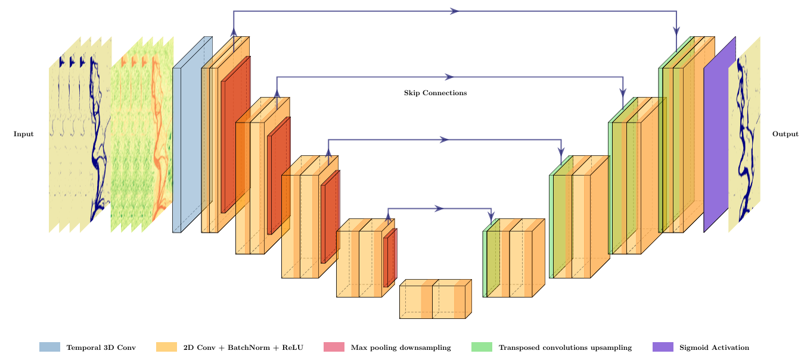

# aiaiaik-ramba

This repository contains the implementation of the project **"Enhancing JamUNet for Plan(t)form Morphodynamics Prediction Using Normalized Difference Vegetation Index (NDVI)"**. The aim of this project is to improve the prediction of channel changes in the Jamuna River using deep learning techniques. By leveraging binary water classification and NDVI data, this model helps distinguish between water and non-water areas while incorporating temporal dependencies through a 3D convolutional approach. This project continues [the work of Antonio Magherini](https://github.com/antoniomagherini/jamunet-morpho-braided/).

Key objectives:
- Test and validate JamUNet results for binary classification.
- Introduce temporal dependencies via 3D convolution to improve morphodynamic predictions.
- Utilize NDVI data to enhance the model's ability to infer vegetation changes.

This repository includes all necessary scripts, notebooks, and instructions to generate datasets, train the models, and visualize the results.

The final visualization of our model's architecture is shown below.





## 1. Getting Started

Create a new conda environment from the `env.yaml` as

```
conda env create -f env.yaml
```

Once created, activate the environment with
```
conda activate aiaiai_env
```

Ensure `ipykernel` is installed with
```
conda install -n aiaiai_env ipykernel --update-deps --force-reinstall
```

### (Optinal and highly recommended) Download all data

<div style="border-left: 4px solid #3498db; padding: 10px; background-color: #f0f8ff;"><strong>📝 Note:</strong> If you follow this step, you can skip step <strong>2. Generating the datasets</strong>.</div> <br>

Download the entire `data/` folder [here](www.google.com).

## 2. Generating the datasets

### 2.1 Generating NDVI dataset

Follow the instructions in the [NDVI README.md](https://github.com/guin0x/aiaiaik-ramba/blob/main/NDVI_processing/README.md)

<div style="border-left: 4px solid #3498db; padding: 10px; background-color: #f0f8ff;">
  <strong>📝 Note:</strong> For easiness of reproduction, we have already stored all the data that would come out of the 
  <code>NDVI_processing</code> pipeline under <code>data/ndvi/output_NDVI</code>. 
  So you can skip <strong>Step 2.2</strong> and proceed to <strong>Step 3</strong>.
</div>

### 2.2 Generating final dataset

To prepare the final dataset which uses both the binary + NDVI data, run the `Prepare_Datasets.ipynb` Jupyter Notebook. It should create the following three files:
```
data/train_set.h5
data/val_set.h5
data/test_set.h5
```

<div style="border: 1px solid red; padding: 10px; background-color: #fff3cd;">
  <strong>⚠️ Attention:</strong> Please note that this dataset generation code only works on <strong>Windows</strong>. It does not work in the <strong>RunPod</strong> machines.</div><br>

If you downloaded the data in step 1, you should have three different versions as shown below.

```
data/
  ├── val_set_prep.h5
  ├── val_set_ndvi_v7.h5
  ├── val_set_3d.h5
  ├── train_set_prep.h5
  ├── train_set_ndvi_v7.h5
  ├── train_set_3d.h5
  ├── test_set_prep.h5
  ├── test_set_ndvi_v7.h5
  └── test_set_3d.h5
```

- The `*_prep.h5` are the original data from Antonio and should be run with `notebook.ipynb` to get his results.

- The `*3d.h5` are to be run with `notebook3d.ipynb`, which has the 3D convolution implemented.

- The `*_ndvi_v7.h5` are the final dataset, which has the NDVI data implemented, and should be run wiht `notebookNDVI.ipynb`


## 3. Training the model

Run the `NotebookNDVI.ipynb`, the models will be saved in `model/models_trained/*.pth` and the metrics saved in `model/losses_metrics/*.csv`. Alternatively, run `notebook.ipynb` or `notebook3d.ipynb` to train the models using the other datasets, as explained above.

<div style="border-left: 4px solid #3498db; padding: 10px; background-color: #f0f8ff;">
  <strong>📝 Note:</strong> The hyperparameters used in <code>NotebookNDVI.ipynb</code> to train our final version of the model 
  were found by performing <strong>hyperparameter optimization</strong>, which can be found under 
  <code>notebookNDVI_hyper_opt_M1.ipynb</code> and <code>notebookNDVI_hyper_opt_M2.ipynb</code>.
</div>


## 4. Visualizing the results

To visualize the results, run the `plotting_NDVI.ipynb`.
